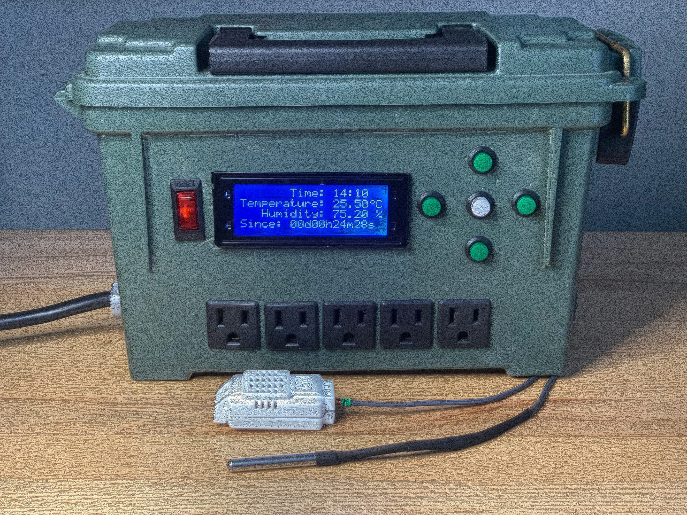

# Climate Controller | Contrôleur de Climat

[English](#english) | [Français](#français)

---

# English

## Overview
An Arduino-based climate control system for managing temperature, humidity, and lighting in enclosed environments.

### Key Features
- 🌡️ Temperature & humidity control
- 💡 Programmable lighting
- 🔄 Bilingual interface
- ⚡ 5-relay control system
- 💾 Persistent settings storage
- 🖥️ LCD interface

### Hardware Required
- Arduino (Uno/Mega/Nano)
- DHT22 sensor
- DS3231 RTC module
- 20x4 I2C LCD display
- 5 momentary switches
- 5 control relays

### Quick Start
1. Connect components
2. Upload code
3. Configure settings via LCD
4. Monitor & enjoy automated control

---

# Français

## Aperçu
Système de contrôle climatique basé sur Arduino pour gérer la température, l'humidité et l'éclairage dans des environnements fermés.

### Caractéristiques Principales
- 🌡️ Contrôle température & humidité
- 💡 Éclairage programmable
- 🔄 Interface bilingue
- ⚡ Système à 5 relais
- 💾 Sauvegarde des paramètres
- 🖥️ Interface LCD

### Matériel Requis
- Arduino (Uno/Mega/Nano)
- Capteur DHT22
- Module RTC DS3231
- Écran LCD 20x4 I2C
- 5 interrupteurs momentanés
- 5 relais de contrôle

### Démarrage Rapide
1. Connecter les composants
2. Téléverser le code
3. Configurer via LCD
4. Surveiller & profiter du contrôle automatisé

---

## Support | Soutien | 
- 🌐 www.guillaumeguiss.com
- 📧 controller@guillaumeguiss.com

## License | Licence 
GNU General Public License
